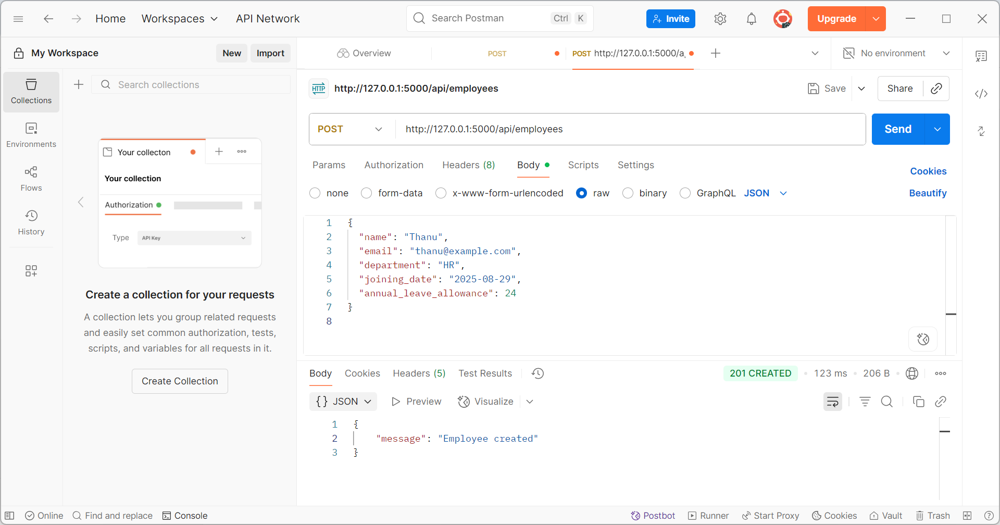
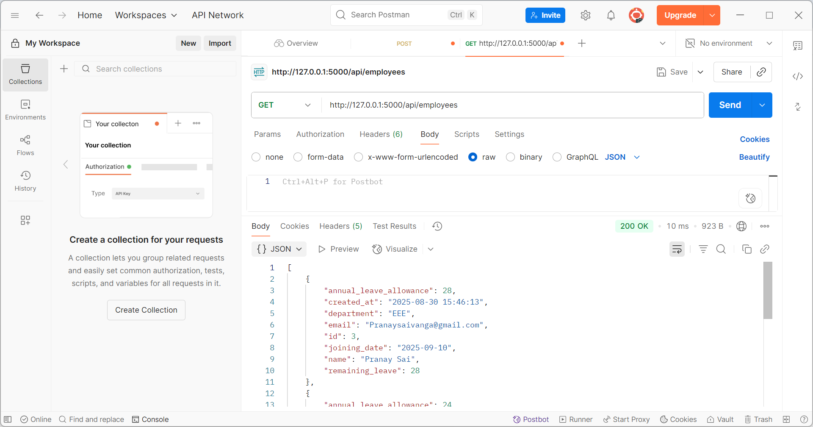
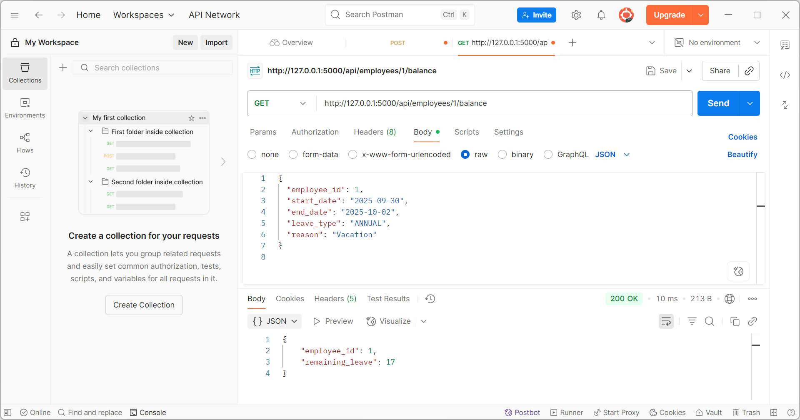
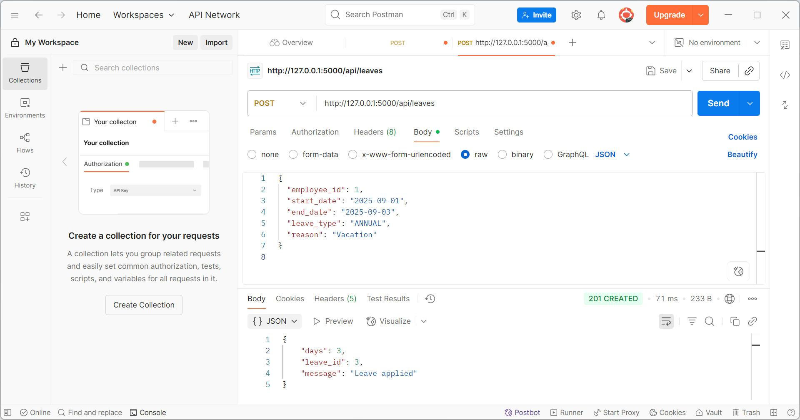
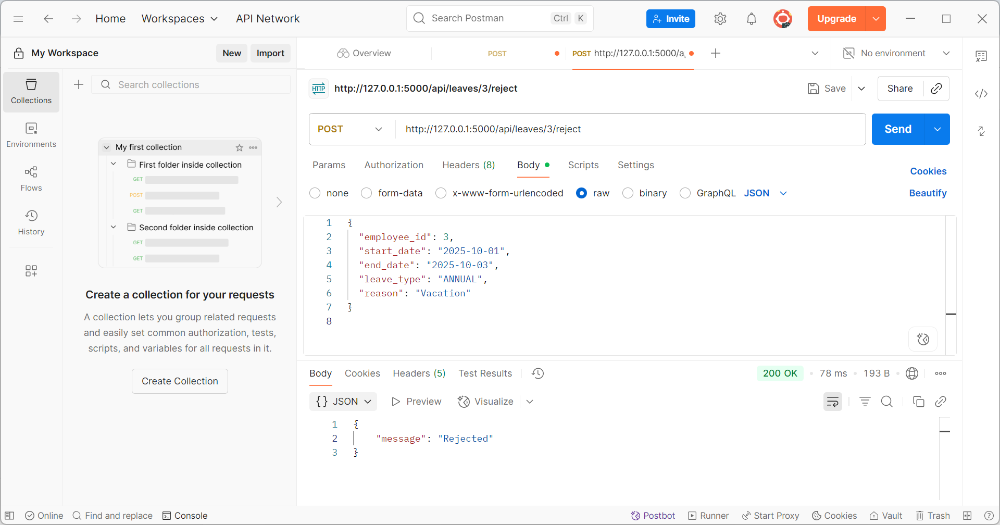
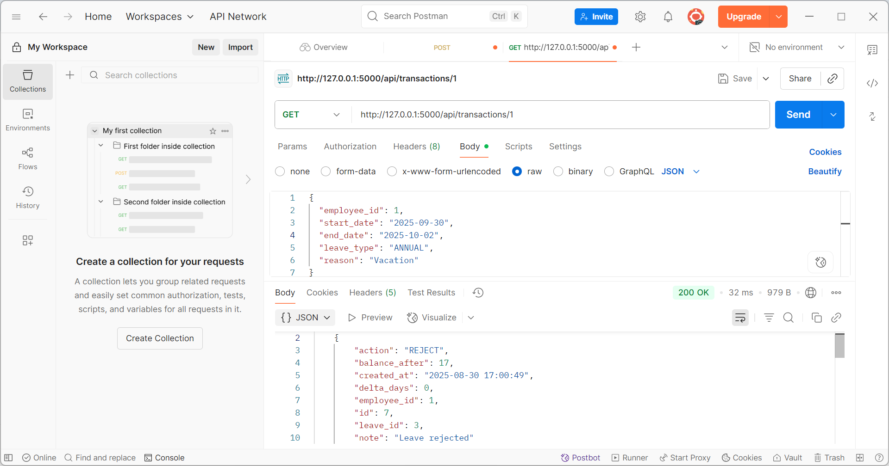

# Mini Leave Management System (Flask + SQLite)

A minimal MVP for a Leave Management System that lets HR:
- Add employees
- Apply, approve, and reject leave requests
- Track leave balance per employee

## Quick Start

### 1) Prerequisites
- Python 3.10+
- pip

### 2) Setup (Windows PowerShell / macOS / Linux)
```bash
## clone the repository
git clone https://github.com/ThanuSriSamala/mini-leave-mgmt
cd mini-leave-mgmt
##Create virtual environment
python -m venv venv
# Windows:
venv\Scripts\activate
# macOS/Linux:
# source venv/bin/activate
##3.install Dependencies
pip install -r requirements.txt
##Run the Application
python run.py
# App runs at http://127.0.0.1:5000
```

> The SQLite DB is created under `instance/app.db` on first run.

---

## Data Model (ER Diagram)


The ER diagram above represents the basic structure of the **Leave Management System**:

- **Employees**: Stores employee details such as name, email, department, joining date, and leave allowance. Each employee has a unique `id`.  
- **Leaves**: Represents leave applications. Each leave request belongs to one employee (`employee_id` as foreign key). It includes details like start date, end date, type of leave, reason, and current status (`PENDING`, `APPROVED`, `REJECTED`).  
- **Leave_Transactions**: Tracks all actions related to leaves, such as applying, approving, or rejecting. It helps in maintaining an audit trail of changes in leave balances. Each transaction is linked to both an employee and a leave request.

**Relationships:**
- One employee can apply for multiple leaves.  
- One employee can have multiple leave transactions.  
- A single leave request can generate one or more transactions (e.g., apply, approve, reject).  

This design ensures **data integrity**, provides a clear **audit history**, and makes it easy to calculate the remaining leave balance for every employee.


**Keys & Indexes**
- Primary keys: `employees.id`, `leaves.id`, `leave_transactions.id`
- Foreign keys: `leaves.employee_id → employees.id`, `leave_transactions.employee_id → employees.id`, `leave_transactions.leave_id → leaves.id`
- Indexes: `idx_leaves_emp (leaves.employee_id)`, `idx_leaves_status (leaves.status)`

---

## Low Level Design

### Modules
- `app/db.py` – DB connection + schema bootstrap
- `app/models.py` – domain helpers (e.g., day calculations)
- `app/routes.py` – HTML pages + REST API

### Services (within routes)
- **EmployeeService**
  - Create employee (init `remaining_leave = allowance`)
  - Get employee / list employees
  - Get balance
- **LeaveService**
  - Apply leave (creates PENDING leave; logs `APPLY`)
  - Approve leave (validates balance for ANNUAL; deducts; logs `APPROVE`)
  - Reject leave (no deduction; logs `REJECT`)
  - List leaves with filters

### Pseudocode (Approval)
```
find leave by id
if leave.status != PENDING: error
emp = get employee(leave.employee_id)
if leave.type == ANNUAL and emp.remaining_leave < leave.days:
    error "Insufficient balance"
update leave.status = APPROVED
if leave.type == ANNUAL:
    emp.remaining_leave -= leave.days
log transaction(action=APPROVE, delta=-days, balance_after=emp.remaining_leave)
commit
```

---

## REST API

### Create Employee
```
POST /api/employees
{
  "name": "Thanu Sri", "email": "thanusrisamala@gmail.com",
  "department": "CSE", "joining_date": "2025-09-30",
  "annual_leave_allowance": 20
}
→ 201 {"message":"Employee created"}
```



### List Employees
```
GET /api/employees
→ 200 [ { ... } ]
```

### Get Employee
```
GET /api/employees/1
→ 200 { ... }
```


### Get Balance
```
GET /api/employees/1/balance
→ 200 {"employee_id":1,"remaining_leave":24}
```


### Apply Leave
```
POST /api/leaves
{
  "employee_id": 1,
  "start_date": "2025-09-01",
  "end_date": "2025-09-03",
  "leave_type": "ANNUAL",
  "reason": "Vacation"
}
→ 201 {"message":"Leave applied","leave_id":2,"days":3}
```
Apply Leave



### Approve Leave
```
POST /api/leaves/2/approve
→ 200 {"message":"Approved","new_balance":21}
```

### Reject Leave
```
POST /api/leaves/2/reject
→ 200 {"message":"Rejected"}
```


### List Leaves (filters)
```
GET /api/leaves?status=PENDING
GET /api/leaves?employee_id=1
```

### Transactions (Audit)
```
GET /api/transactions/1
→ [ { action:"APPLY" ... }, { action:"APPROVE" ... } ]
```

---

## Screens (HTML)
- `/` Dashboard with quick stats
- `/employees` Create & list employees
- `/leaves` Apply + list & approve/reject

> This is a lightweight Bootstrap UI for MVP validation. In production, move to a dedicated frontend (React, etc.).

---

## Assumptions
- Company size ~50 employees (MVP constraints)
- Default annual leave allowance = 24; configurable per employee
- Only ANNUAL leave affects balance; SICK/UNPAID do not (adjust to policy)
- Weekends/holidays are **counted** as days in this MVP (simple). Enhance by a holiday calendar later.

## Edge Cases Covered
- End date before start date → 400 error
- Approving non-pending leaves → 400
- Insufficient balance on approval → 400
- Unique email constraint on employees

## Potential Improvements
- Auth (roles: HR vs Employee Login)
- Holiday calendar & working-day calculation
- Partial-day leaves (half-day)
- File attachments & notes
- Email/Slack notifications
- Pagination & search
- CI tests and code coverage
- Deployment via Render/Heroku or Docker

---

## Run Tests (placeholder)
```bash
pytest  # add tests in /tests
```

## Deploy (Render example)
- Create a new Web Service, build command: `pip install -r requirements.txt`
- Start command: `python run.py`
- Add environment variable `SECRET_KEY`
```

